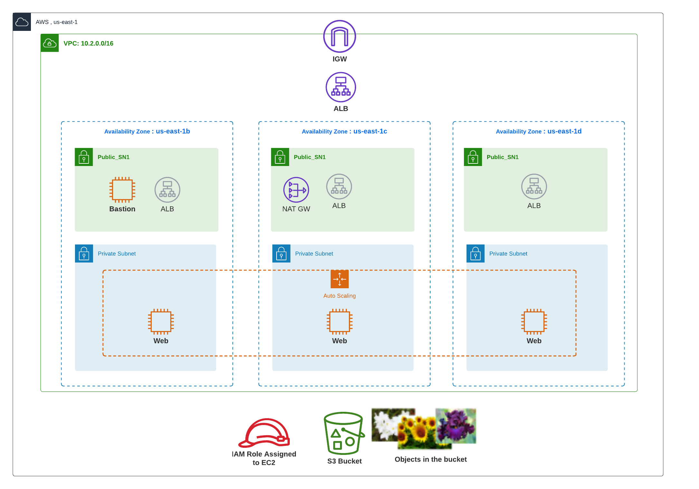
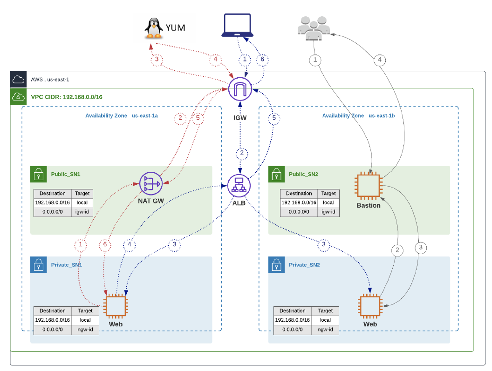

# Two-Tier Web Application Automation with Terraform on AWS

**Course:** ACS730: Cloud Automation and Control Systems  
**Term:** Winter 2026  
**Type:** Final Project  
**Instructor:** Leo Lu  

## Team Members:
- Selva Roshan Sivagnanasundaram Rexon - 126332246
- Indah Cahyani Styoningrum - 115029258
- Huu Duc Huy Nguyen - 125109249
- Leandro Delgado - 114416241

**Repository:** https://github.com/jaydenhnguyen/two-tiers-web-app

---
## 📌 Project Overview

This project demonstrates **Infrastructure as Code (IaC)** using Terraform to deploy a **highly available, scalable two-tier web application** on AWS.

The solution provisions:
- Application Load Balancer (ALB)
- Auto Scaling Group (ASG) across 3 Availability Zones
- EC2 web servers in private subnets
- Bastion host for secure SSH access
- Private S3 bucket for storing website images
- IAM roles for secure access control

The web application serves a static site with images dynamically loaded from a **private S3 bucket**.

This project also follows DevOps practices by integrating CI/CD pipelines using GitHub Actions for automated validation and security scanning.

---
## 🏗️ Architecture Summary

- **Frontend Layer:** Application Load Balancer (public)
- **Backend Layer:** EC2 instances (private subnets, ASG)
- **Access Layer:** Bastion host (public subnet)
- **Storage:** Private S3 bucket (images + Terraform state)
- **Networking:** Custom VPC with public & private subnets across 3 AZs

✔ Highly available  
✔ Scalable (CPU-based scaling policies)  
✔ Secure (private subnets + IAM + no public S3 access)  

## Architecture Diagram


## 🔄 Traffic Flow



This diagram illustrates how traffic flows through the system:
- User requests enter through the ALB
- ALB distributes traffic to EC2 instances in private subnets
- EC2 instances retrieve images securely from S3 using IAM roles

---

## 🌍 Environment Configuration

| Environment | VPC CIDR         | Min Instances | Instance Type   |
|-------------|------------------|---------------|-----------------|
| **Dev**     | `10.100.0.0/16`  | 2             | `t3.micro`      |
| **Staging** | `10.200.0.0/16`  | 3             | `t3.small`      |
| **Prod**    | `10.250.0.0/16`  | 3             | `t3.medium`     |

- Subnets: `/24` (256 IPs each)
- AZs: 3 (high availability)
- ASG: min 1 – max 4 instances
- Scaling:
  - Scale out: CPU > 10%
  - Scale in: CPU < 5%

---

## 📌 Configuration Notes

- ASG configuration:
  - `server_min_size` and `server_desired_capacity` must match environment requirements
  - `server_max_size` is set to **4** (assignment maximum)

- Subnet design:
  - Public subnets: `10.x.0.0/24`, `10.x.1.0/24`, `10.x.2.0/24`
  - Private subnets: `10.x.10.0/24`, `10.x.11.0/24`, `10.x.12.0/24`

- Availability Zones:
  - Default: `us-east-1a`, `us-east-1b`, `us-east-1c`
  - May vary depending on AWS account

---

## 📁 Project Structure

High-level layout of the repository:

```text
.
├── .github/
│   └── workflows/          # CI: Terraform fmt, tflint, trivy (see workflows for branch rules)
├── environments/
│   ├── dev/                # Full root module: main.tf, backend, variables, outputs (use this as the template)
│   ├── staging/            # Provider version pin only today — copy dev here for staging deploys
│   └── prod/               # Provider version pin only today — copy dev here for prod deploys
├── modules/
│   ├── alb/                # Application Load Balancer, target group, HTTP listener
│   ├── asg/                # Auto Scaling Group, scaling policies, CPU CloudWatch alarms
│   ├── bastion/            # Bastion EC2 in a public subnet
│   ├── iam/                # EC2 instance profile + IAM policy for private S3 read
│   ├── network/            # VPC, public/private subnets, IGW, NAT, route tables
│   ├── security/           # Security groups (ALB, web, bastion) and rules
│   └── web_server/         # Launch template, user_data bootstrap (httpd + S3 image)
├── README.md
├── .gitignore              # Ignores *.tfvars, .terraform/, etc. — do not commit secrets or keys
├── .tflint.hcl
└── .trivyignore
```

Each module folder typically contains:

| File           | Role                                |
|----------------|-------------------------------------|
| `main.tf`      | Resources for that module           |
| `variables.tf` | Input variables                     |
| `outputs.tf`   | Exported values for the root module |

**`environments/dev`** (root module you run with `terraform apply`):

| File                       | Role                                                                                 |
|----------------------------|--------------------------------------------------------------------------------------|
| `main.tf`                  | Wires modules together (network → security → iam → alb → web_server → bastion → asg) |
| `version.tf`               | Terraform and AWS provider version constraints                                       |
| `backend.tf`               | Remote state backend (S3 bucket + state key)                                         |
| `variables.tf`             | Infra inputs (region, CIDRs, ASG sizes, AMI, buckets, SSH CIDRs, etc.)               |
| `inputs.tf`                | Team / owner inputs (`project_name`, `team_name`, `team_members`, `additional_tags`) |
| `outputs.tf`               | `website_url`, bastion outputs, VPC id                                               |
| `terraform.tfvars.example` | Example values — copy to `terraform.tfvars` (gitignored)                             |

**`modules/web_server`**: also includes `user_data.sh.tftpl` (shell script template for instance bootstrap).

---

## 🏷️ Naming Convention

Resources follow a consistent naming strategy to ensure clarity and maintainability.

- **Format:** `GroupName-Environment-Resource`  
- **Example:** `Group3-Dev-VPC`  
- **Convention:** CamelCase is used across all AWS resources  

This approach helps with:
- Easy identification of resources  
- Consistent structure across environments  
- Simplified management and troubleshooting  

---

Instructions below assume a **local machine** (macOS/Linux or WSL), not AWS Cloud9.

---

## ⚙️ Prerequisites

Before deployment:

- **Terraform** `>= 1.14.0` — [Install Terraform](https://developer.hashicorp.com/terraform/install)
- **AWS CLI v2** — [Install AWS CLI](https://docs.aws.amazon.com/cli/latest/userguide/getting-started-install.html)
- AWS account with required IAM permissions for VPC, EC2, ALB, ASG, IAM (roles/policies), security groups, and S3
- SSH client 
- **OpenSSH** for bastion access

Verify:
```bash
terraform version
aws --version
```
## 🧰 Manual setup (Required)

### 1. Create S3 Buckets (per environment)

**Each** environment (dev, staging, and prod) requires:
- **Remote state bucket** — globally unique name; versioning and encryption recommended; block public access.
- **Website image bucket** (can be the same bucket as state if you separate by prefix, but the assignment asks for per-environment buckets — use one bucket per env for clarity). **Do not** make the image bucket public; web servers use IAM to read objects.

Requirements:
- Enable versioning
- Block public access
- Use unique bucket names

In this repo, **dev** remote state is configured in `environments/dev/backend.tf` (example: bucket `acs730-group3-final-project`, key `dev/terraform.tfstate`, region `us-east-1`). **Replace** bucket/key with your own buckets for staging and prod, for example:
- Staging state key: `staging/terraform.tfstate`
- Prod state key: `prod/terraform.tfstate`

---

### 2. Upload Website Image

Upload your image so the key matches `image_file_name` in `terraform.tfvars`.

```bash
aws s3 cp ./image.png "s3://YOUR_IMAGE_BUCKET_NAME/images/image.png"
```

`image_bucket_name` in Terraform must be the **bucket name only**. `image_file_name` is the **object key** (e.g. `images/image.png`).

### 3. SSH Key Pair

If you do not have a key pair in AWS:

```bash
ssh-keygen -t ed25519 -f ./acs730_key -N ""

aws ec2 import-key-pair \
  --region us-east-1 \
  --key-name "acs730_key" \
  --public-key-material fileb://acs730_key.pub
```

Use the same `key_pair_name` in `terraform.tfvars`. 
⚠️ Do **NOT** upload private keys to GitHub.

---

## 🔐 AWS Credentials (local)

```bash
aws configure
```

Terraform uses the same credential chain as the AWS CLI (`AWS_ACCESS_KEY_ID`, `AWS_SECRET_ACCESS_KEY`, region, optional session token).

---
## ⚙️ Deployment Steps

### 1. Clone Repository

```bash
git clone https://github.com/jaydenhnguyen/two-tiers-web-app.git
cd two-tiers-web-app
```
### 2. Configure Variables 

This repository includes a full root module under **`environments/dev`**. For **staging** and **prod**, mirror that folder (same `main.tf`, `variables.tf`, `inputs.tf`, `outputs.tf`, `version.tf` pattern), add **`backend.tf`** with the correct S3 bucket and state **key** per environment, and add **`terraform.tfvars`** / **`terraform.tfvars.example`**.

### Dev

```bash
cd environments/dev
cp terraform.tfvars.example terraform.tfvars
# Edit terraform.tfvars and fill all values (see assignment table for CIDR, sizes, instance types).
```

Files split roughly as:

- `variables.tf` — region, AZs, AMI, networking, ASG sizes, bastion type, etc.
- `inputs.tf` — `project_name`, `team_name`, `team_members`, `additional_tags`

### Staging (values from assignment)

- `vpc_cidr`: `10.200.0.0/16`
- Public / private subnet lists: use three `/24` subnets per layer.
- `vm_instance_type`: `t3.small`
- `server_min_size` / `server_desired_capacity`: **3** (and `server_max_size`: **4** unless you cap lower)
- Separate **S3 state bucket** (or key under a shared bucket) and **image bucket** for staging.

### Prod (values from assignment)

- `vpc_cidr`: `10.250.0.0/16`
- `vm_instance_type`: `t3.medium`
- `server_min_size` / `server_desired_capacity`: **3**
- Separate state and image buckets for prod.

### 3. Deploy Infrastructure 

From the environment directory (e.g. `environments/dev`):

```bash 
terraform init
terraform plan
terraform apply
```

---

## 🌐 Outputs

```bash 
terraform output
```

- **`website_url`** — open in a browser; should show team info and the image from S3.
- **`bastion_public_ip`** — SSH to bastion using your private key.

```bash
chmod 400 /path/to/acs730_key
ssh -i /path/to/acs730_key ec2-user@<BASTION_PUBLIC_IP>
```

Use `ubuntu@...` if your AMI is Ubuntu instead of Amazon Linux.

---

## 🔎 Verification

- Target group: all instances **healthy** behind the ALB.
- ASG: capacity and AZ spread match your settings; scaling alarms exist for CPU 10% / 5%.
- Website loads via ALB DNS; image appears (copied from private S3 at bootstrap).

---

## 🧪 GitHub Actions

Includes: 
- `terraform fmt` - format validation
- `tflint` - linting
- `trivy` - security scanning

Triggered on: 
- Push to staging 
- PR to prod 

CI runs Terraform formatting checks and security scans (see `.github/workflows/`). Push to the branches configured there so scans run as required for the course.

---

## 🔐 Security
- Private subnets for EC2
- Bastion host for SSH
- IAM roles for S3 access
- No public S3 bucket
- No secrets in repo

---

## 🧹 Cleanup

```bash
terraform destroy
```

Empty or delete S3 buckets only after you no longer need state or objects (destroy state bucket last).

---

## ⚠️ Troubleshooting

| Issue                               | What to check                                                                          |
|-------------------------------------|----------------------------------------------------------------------------------------|
| `terraform init` backend error      | Bucket name, region, IAM on state bucket                                               |
| SSH `Permission denied (publickey)` | `key_pair_name` matches imported key; use `-i` with correct `.pem` / private key       |
| No image on site                    | `image_bucket_name` / `image_file_name`; IAM `s3:GetObject` on `arn:aws:s3:::BUCKET/*` |
| `fmt` / validate failures in CI     | Run `terraform fmt -recursive` locally and commit                                      |

---

## 🎯 Learning Outcomes
- Infrastructure as Code (Terraform)
- AWS architecture design
- DevOps (CI/CD with GitHub Actions)
- Security best practices
- High availability (ASG + ALB)

--- 

## 📌 Notes
- Separate environments (dev/staging/prod)
- Do not commit .tfvars, .terraform, or keys

---

## 📄 License
**Academic use only for ACS730 Final Project**
